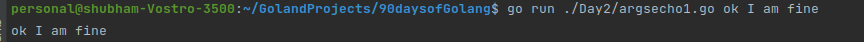
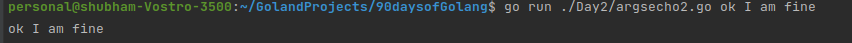
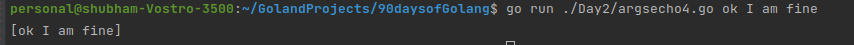

# Introduction to Go language.

#### Command-line arguments

---
* Command-line arguments means the arguments that are passed with the go commands using your terminal windows.
* Command-line arguments are available to your go code/ program using the package variable called Args; that is the part of os packages.
* The `os` package provides functions and other values for handling the operating system tasks in a platform-independent fashion.
* You can access Args variable in your program using `os.Args`.
* The variable `os.Args` will return the slice of strings.
* The first value i.e. `os.Args[0]` will always return the name of command itself.

---
**Let us understand this using some examples:**

Example 1 : `argsecho1.go`
```go
package main
// args-echo1 prints the command line arguments received.(Using for loop)
import (
	"fmt"
	"os"
)

func main() {
	var args, separate string
	for i := 1; i < len(os.Args); i++ {
		args += separate + os.Args[i]
		separate = " "
	}
	fmt.Println(args)
}

```
`Output:`


Example 2 : `argsecho2.go`
```go
package main
// args-echo2 prints the command line arguments received.(Using for range loop)
import (
	"fmt"
	"os"
)

func main() {
	args, separate := "", ""
    for _, arg := range os.Args[1:] {
		args += separate + arg
		separate = " "
    }
	fmt.Println(args)
}

```

`Output:`



**If the amount of data involved is very large, then using for or for range for that above operations can become very costly. To overcome this problem, we use a simple and efficient solutions that will use  `Join` function from the `strings` package.**

Example 3 : `argsecho3.go`
```go
package main

// args-echo3 prints the command line arguments received.(Using strings.Join )
import (
	"fmt"
	"os"
	"strings"
)

func main() {
	fmt.Println(strings.Join(os.Args[1:], " "))
}
```

`Output:`


*If you don't care about the formatting,and just want to see the values for debugging purpose use following*

Example 4 : `argsecho4.go`
```go
package main

import (
	"fmt"
	"os"
)

func main() {
	fmt.Println(os.Args[1:])
}
```
`Output:`


---
Exercises:
1. Modify any of the echo program to also print `os.Args[0]`, the name of the command that invoked it.
2. Modify the echo program to print the index and value of each of its arguments.
3. Experiment to measure the difference in running time between our potentially inefficient versions and the one using `strings.Join()`.